# Estate Archive — CMS Manager (Visual Page Builder) Guide

> অন্য প্রজেক্টে implement করার জন্য সম্পূর্ণ architecture, data model, API, frontend flow ও diagram।

---

## ১. সংক্ষিপ্ত সারাংশ

CMS Manager হলো একটি **Visual Page Builder** যেখানে admin:

- Website page-এর **preview** দেখে
- Section / Block **add, edit, delete, hide, reorder** করে
- **Reset** দিয়ে default design ফেরায়
- Save করলেই **live public site** আপডেট হয়

মূল মডেল: **Page → Section → Block**

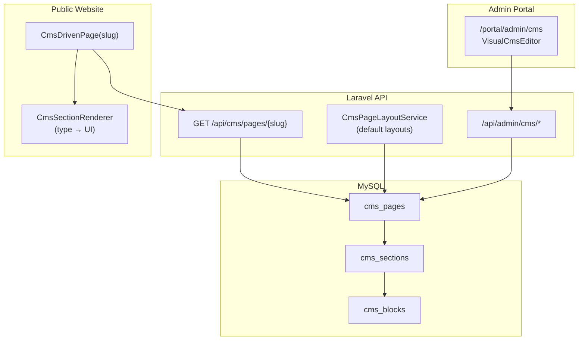

---

## ২. Data Model (৩-লেয়ার)

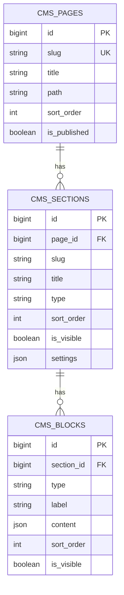

### টেবিল বিবরণ

| Table | কাজ |
|-------|-----|
| `cms_pages` | Home / Explore / How It Works — page-level meta |
| `cms_sections` | Hero, Steps, Footer ইত্যাদি — `type` দিয়ে UI নির্ধারণ |
| `cms_blocks` | Heading, text, button, image — আসল content JSON-এ |

**Cascade:** Page delete → sections delete → blocks delete।

**Migration:** `backend/database/migrations/2024_01_01_000009_create_cms_page_layout_tables.php`

---

## ৩. Architecture Overview

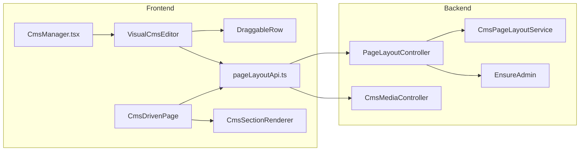

---

## ৪. File Map (কপি করার ফাইল)

### Backend

```
backend/
├── database/migrations/2024_01_01_000009_create_cms_page_layout_tables.php
├── app/Models/CmsPage.php
├── app/Models/CmsSection.php
├── app/Models/CmsBlock.php
├── app/Http/Controllers/PageLayoutController.php
├── app/Http/Controllers/CmsMediaController.php
├── app/Services/CmsPageLayoutService.php
├── app/Http/Middleware/EnsureAdmin.php
├── database/seeders/CmsPageLayoutSeeder.php
└── routes/api.php
```

### Frontend

```
src/
├── pages/admin/CmsManager.tsx
├── services/pageLayoutApi.ts
├── components/cms/
│   ├── CmsDrivenPage.tsx
│   ├── CmsSectionRenderer.tsx
│   └── editor/
│       ├── VisualCmsEditor.tsx
│       └── DraggableRow.tsx
└── app/routes.tsx   → /portal/admin/cms
```

---

## ৫. API Endpoints

### Public (no auth)

| Method | Endpoint | কাজ |
|--------|----------|-----|
| `GET` | `/api/cms/pages` | সব published pages |
| `GET` | `/api/cms/pages/{slug}` | একটা page (visible sections/blocks only) |

### Admin (`auth:sanctum` + `admin` role)

| Method | Endpoint | কাজ |
|--------|----------|-----|
| `GET` | `/api/admin/cms/pages/layout` | Editor-এর জন্য full layout |
| `POST` | `/api/admin/cms/pages` | নতুন page |
| `PATCH` | `/api/admin/cms/pages/{id}` | Page update |
| `DELETE` | `/api/admin/cms/pages/{id}` | Page delete |
| `POST` | `/api/admin/cms/pages/{id}/reset` | এক page default-এ |
| `POST` | `/api/admin/cms/pages/reset-all` | সব default-এ |
| `POST` | `/api/admin/cms/sections` | Section add |
| `PATCH` | `/api/admin/cms/sections/{id}` | Title / type / visibility |
| `DELETE` | `/api/admin/cms/sections/{id}` | Section delete |
| `POST` | `/api/admin/cms/blocks` | Block add |
| `PATCH` | `/api/admin/cms/blocks/{id}` | Content / label / visibility |
| `DELETE` | `/api/admin/cms/blocks/{id}` | Block delete |
| `POST` | `/api/admin/cms/reorder` | Drag-drop sort_order |
| `POST` | `/api/admin/cms/media` | Image upload |

### Auth flow

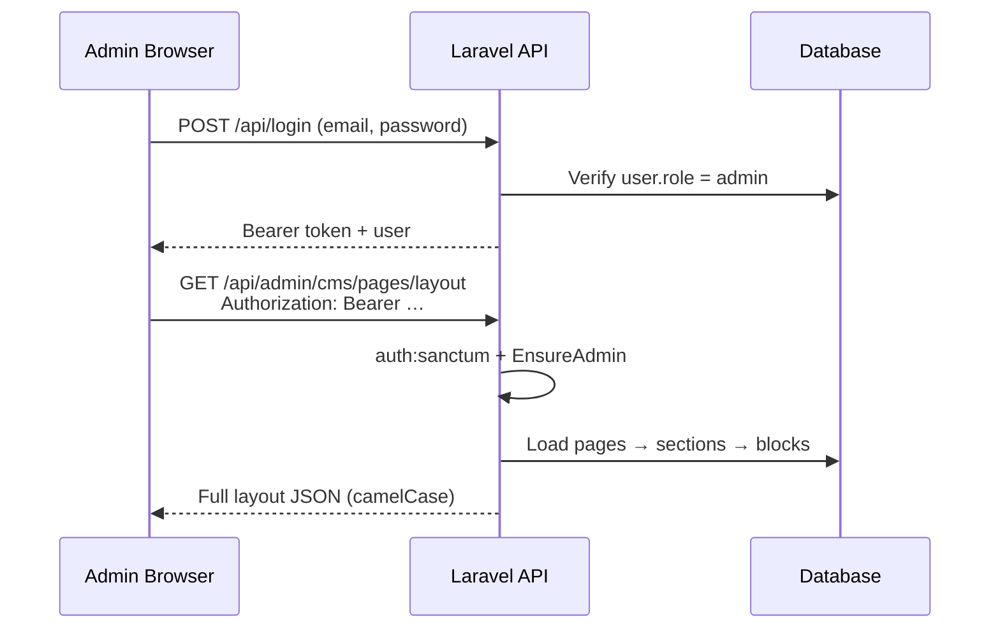

---

## ৬. TypeScript Types

```ts
interface CmsBlockContent {
  text?: string;
  title?: string;
  description?: string;
  desc?: string;
  detail?: string;
  num?: string;
  url?: string;
  cta?: string;
  eyebrow?: string;
  variant?: string;
  cmsKey?: string;
  highlight?: string;
  imageUrl?: string;
  alt?: string;
  [key: string]: string | undefined;
}

interface CmsBlock {
  id: string;
  sectionId: string;
  type: string;       // heading | text | button | card | step | image | eyebrow
  label: string;
  content: CmsBlockContent;
  sortOrder: number;
  isVisible: boolean;
}

interface CmsSection {
  id: string;
  pageId: string;
  slug: string;
  title: string;
  type: string;       // hero | steps | footer | …
  sortOrder: number;
  isVisible: boolean;
  settings: Record<string, unknown>;
  blocks: CmsBlock[];
}

interface CmsPage {
  id: string;
  slug: string;
  title: string;
  path: string;
  sortOrder: number;
  isPublished: boolean;
  sections: CmsSection[];
}
```

---

## ৭. Section Type → React Renderer Map

`CmsSectionRenderer.tsx`-এর switch:

| `section.type` | Component | বর্ণনা |
|----------------|-----------|--------|
| `hero` | `HeroSection` | Headline, tagline, CTA, hero image |
| `choose_path` | `ChooseYourPath` | Investors / Landowners cards |
| `steps` | `StepsSection` | Process step cards |
| `project_grid` | `ProjectGridSection` | Live projects grid |
| `cost_estimator` | `CostEstimator` | Cost calculator widget |
| `page_header` | `PageHeaderSection` | Page title + image |
| `trust_pillars` | `TrustPillarsSection` | Trust cards |
| `cta_banner` | `CtaBannerSection` | Dark CTA strip |
| `footer` | `PublicFooter` | Site footer |
| `quick_links` | `QuickLinksSection` | Link cards |

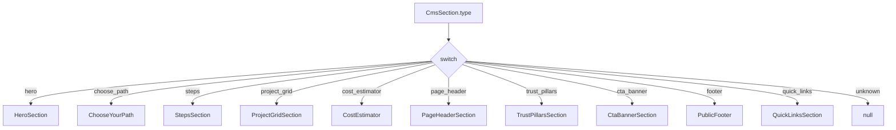

**নতুন section যোগ করতে:**

1. Backend default / DB-তে `type` save করুন  
2. `CmsSectionRenderer` switch-এ নতুন case  
3. `VisualCmsEditor` → `SECTION_TYPES` list-এ যোগ  

---

## ৮. Admin UI Layout

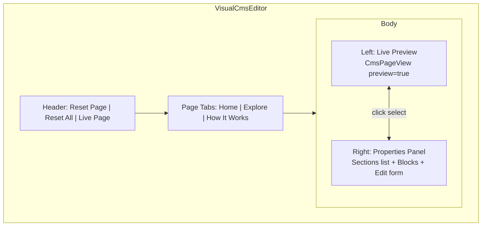

### Properties Panel actions

| Action | API |
|--------|-----|
| Add Section | `POST /admin/cms/sections` |
| Delete Section | `DELETE /admin/cms/sections/{id}` |
| Toggle visibility | `PATCH … { is_visible }` |
| Drag reorder | `POST /admin/cms/reorder` |
| Add / Edit / Delete Block | blocks CRUD |
| Save Block content | `PATCH /admin/cms/blocks/{id}` |
| Upload image | `POST /admin/cms/media` |
| Reset Page | `POST /admin/cms/pages/{id}/reset` |

---

## ৯. Data Flows

### 9.1 Edit → Save → Live site

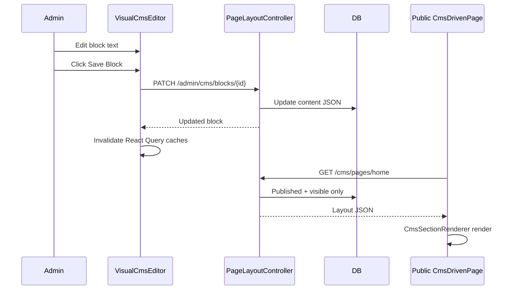

### 9.2 Drag & Drop reorder

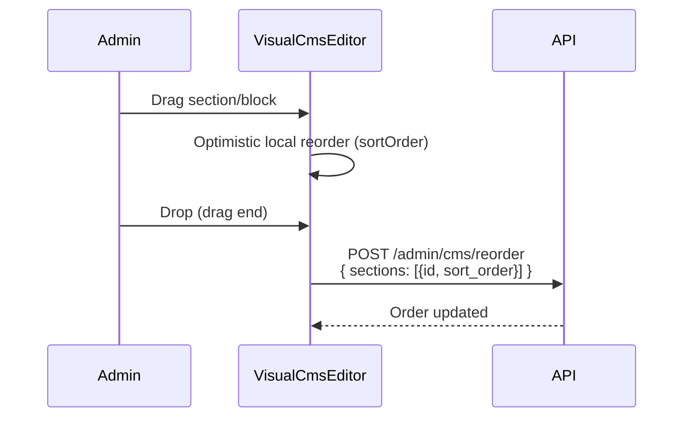

### 9.3 Reset to default

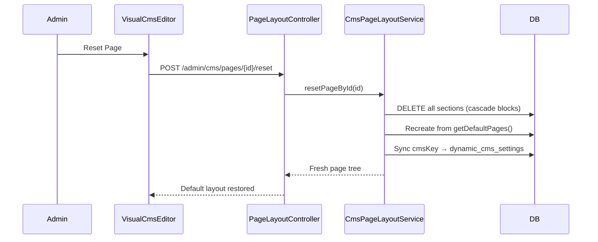

---

## ১০. Default Layout (Home)

Default design **PHP code**-এ থাকে: `CmsPageLayoutService::getDefaultPages()` — DB seed file নয়।

### Home page sections (default)

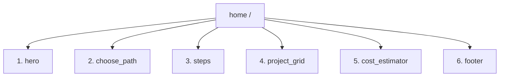

| Order | Section type | Title |
|-------|--------------|-------|
| 0 | `hero` | Hero |
| 1 | `choose_path` | Choose Your Path |
| 2 | `steps` | Process Steps |
| 3 | `project_grid` | Active Ventures |
| 4 | `cost_estimator` | Cost Estimator |
| 5 | `footer` | Footer |

### অন্য pages

| Slug | Path | Sections |
|------|------|----------|
| `explore` | `/explore` | page_header, project_grid, cost_estimator, footer |
| `how-it-works` | `/how-it-works` | page_header, steps, choose_path, trust_pillars, cta_banner, footer |

**Seed:**

```bash
php artisan db:seed --class=CmsPageLayoutSeeder
php artisan storage:link
```

---

## ১১. Public Page Consumption

```tsx
// src/pages/Landing.tsx
export default function Landing() {
  return <CmsDrivenPage slug="home" fallback={<LandingFallback />} />;
}
```

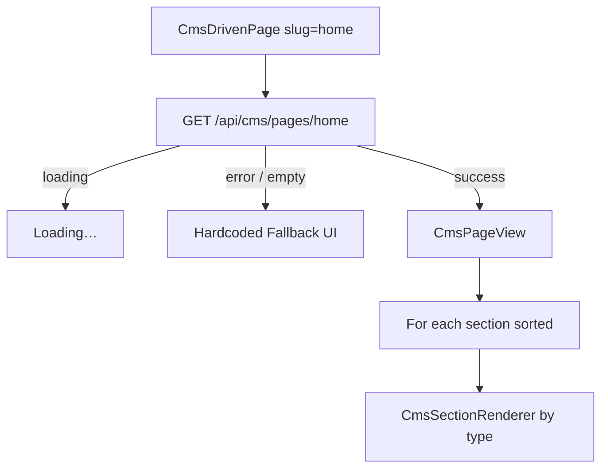

`preview: false` → hidden sections/blocks skip।  
`preview: true` (admin) → সব দেখায়, hidden dimmed।

---

## ১২. Block Content Examples

### Hero heading

```json
{
  "type": "heading",
  "label": "Main Headline",
  "content": {
    "text": "Bangladesh er Prothom Automated Real Estate Co-operative Platform.",
    "highlight": "Automated",
    "cmsKey": "hero_main_headline"
  }
}
```

### Step block

```json
{
  "type": "step",
  "label": "Step 1",
  "content": {
    "num": "1",
    "title": "Select & Verify",
    "desc": "Browse vetted land opportunities…"
  }
}
```

### Image block

```json
{
  "type": "image",
  "label": "Hero Image",
  "content": {
    "imageUrl": "/images/estate/hero-mirage-rosetum.png",
    "alt": "The Mirage Rosetum"
  }
}
```

---

## ১৩. অন্য প্রজেক্টে Implement Checklist

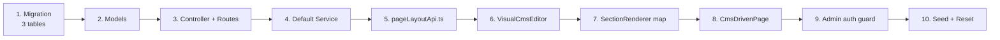

### Step-by-step

1. **DB** — `cms_pages`, `cms_sections`, `cms_blocks` + cascade FK  
2. **Models** — Eloquent relations + casts  
3. **API** — public show + admin CRUD + reorder + reset  
4. **Defaults** — `getDefaultPages()` in-code tree  
5. **Frontend types + API client**  
6. **Visual editor** — preview + properties + react-dnd  
7. **Renderer registry** — `type` → React component  
8. **Public wrapper** — `CmsDrivenPage(slug, fallback)`  
9. **Auth** — Sanctum Bearer + `role === 'admin'`  
10. **Seed / Reset** — first install + recovery button  

---

## ১৪. Demo Credentials

| Role | Email | Password | Portal |
|------|-------|----------|--------|
| Admin | `admin@estatearchive.bd` | `password` | `/portal/admin` |
| CMS | — | — | `/portal/admin/cms` |

---

## ১৫. Quick Commands

```bash
# Backend
cd backend
php artisan migrate
php artisan db:seed --class=CmsPageLayoutSeeder
php artisan storage:link
php artisan serve

# Frontend
npm run dev
# → http://localhost:5173/portal/admin/cms
```

---

## ১৬. Design Rules (এই প্রজেক্টের)

1. **Section.type** = কোন UI component  
2. **Block.content** = editable text/image data (JSON)  
3. Public API শুধু `is_published` + `is_visible` দেয়  
4. Admin API সব দেয় (hidden সহ)  
5. Default design PHP service-এ — Reset সবসময় original ফেরায়  
6. Optional `cmsKey` → `dynamic_cms_settings` overlay (shared copy)

---

*Generated for Estate Archive (Jarin Corporation) — Visual CMS implementation reference.*
