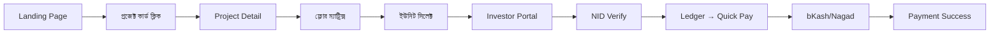
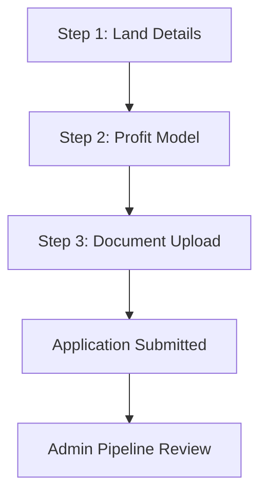
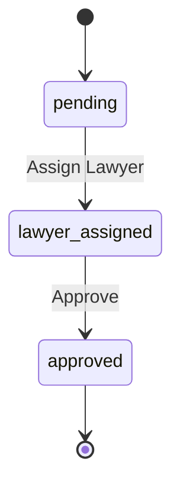
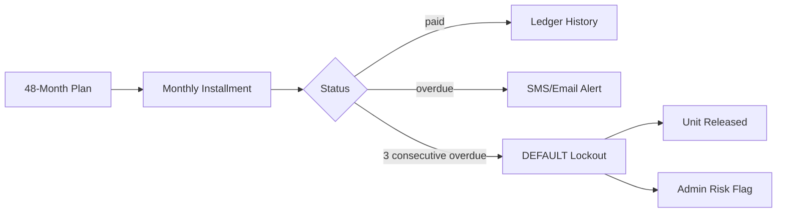
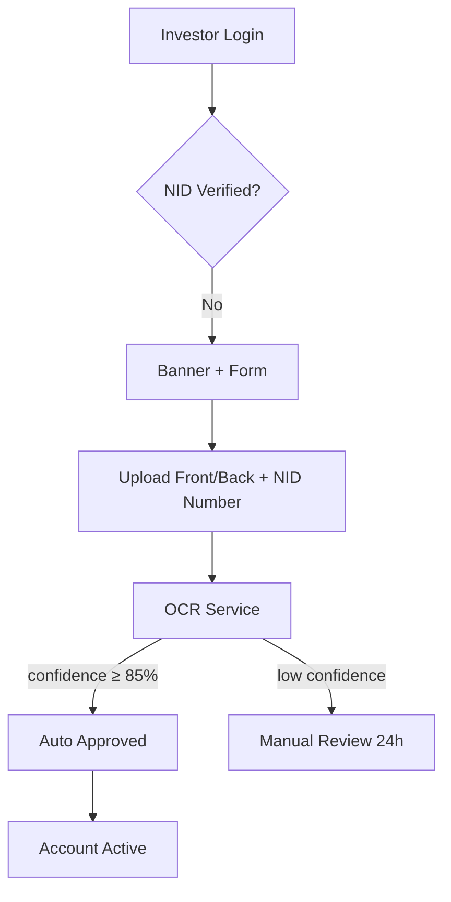
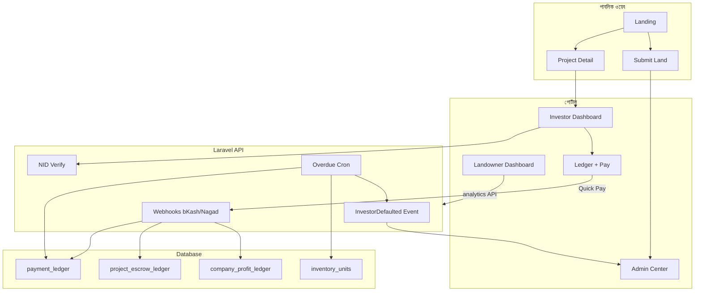

# Estate Archive — সম্পূর্ণ প্রজেক্ট রিপোর্ট

> **স্ক্যান তারিখ:** ১০ জুলাই ২০২৬  
> **প্রজেক্ট নাম:** Estate Archive (Figma থেকে: *Enhance UI Design Elements*)  
> **ধরন:** বাংলাদেশের রিয়েল এস্টেট কো-অপারেটিভ / ক্রাউডফান্ডিং প্ল্যাটফর্ম

---

## ১. সংক্ষিপ্ত বিবরণ

**Estate Archive** হলো একটি অটোমেটেড রিয়েল এস্টেট কো-অপারেটিভ প্ল্যাটফর্ম। এখানে:

- **ইনভেস্টর**রা জমির শেয়ার কিনে কিস্তিতে নির্মাণ খরচ দেয়
- **জমির মালিক**রা জমি জমা দিয়ে উন্নত ইউনিটের অংশ পায় (Joint Venture / 40-60 split)
- **অ্যাডমিন** পুরো প্ল্যাটফর্ম, প্রজেক্ট, পেমেন্ট ও অডিট নিয়ন্ত্রণ করে

মূল ধারণা: *"জমির মালিকানা + বিল্ডিং নির্মাণ খরচ কিস্তিতে — বাজার মূল্যের অর্ধেকে ফ্ল্যাট"*

---

## ২. প্রজেক্ট স্ট্রাকচার (ফোল্ডার ট্রি)

```
Jarin Corporation/
├── index.html                 # Vite entry HTML
├── package.json               # Frontend dependencies & scripts
├── pnpm-workspace.yaml        # Monorepo workspace config
├── vite.config.ts             # Vite + React + Tailwind + @ alias
├── postcss.config.mjs
├── default_shadcn_theme.css   # shadcn/ui theme tokens
├── README.md                  # Basic run instructions
├── ATTRIBUTIONS.md
├── guidelines/
│   └── Guidelines.md          # AI/design guidelines (template)
├── src/                       # React frontend (মূল অ্যাপ)
│   ├── main.tsx
│   ├── app/
│   │   ├── App.tsx            # RouterProvider root
│   │   ├── routes.tsx         # সব route definition
│   │   └── components/ui/     # shadcn/ui component library (~40 files)
│   ├── layouts/
│   │   ├── PublicLayout.tsx   # পাবলিক সাইট navbar
│   │   └── PortalLayout.tsx   # পোর্টাল sidebar + notification
│   ├── pages/                 # সব পেজ কম্পোনেন্ট
│   ├── components/            # Feature-specific components
│   ├── store/authStore.ts     # Zustand auth state
│   ├── services/analyticsApi.ts
│   ├── styles/                # CSS, Tailwind, fonts, theme
│   └── imports/               # Figma-exported assets
└── backend/                   # Laravel API (আংশিক — key files only)
    ├── routes/api.php
    ├── app/
    │   ├── Http/Controllers/
    │   ├── Services/
    │   ├── Models/
    │   ├── Events/
    │   └── Console/Commands/
    └── database/migrations/
```

**মোট ফাইল:** ~১০২টি (frontend-heavy; backend skeleton)

---

## ৩. টেক স্ট্যাক

### Frontend

| প্রযুক্তি | ভার্সন/বিবরণ |
|-----------|---------------|
| React | 18.3.1 (peer) |
| Vite | 6.3.5 |
| TypeScript | .tsx throughout |
| React Router | 7.13.0 |
| Tailwind CSS | 4.1.12 |
| Zustand | 5.x — auth persistence |
| Recharts | চার্ট/গ্রাফ |
| Motion (Framer) | অ্যানিমেশন |
| Radix UI + shadcn | UI primitives |
| Lucide React | আইকন |
| react-hook-form | ফর্ম হ্যান্ডলিং |
| canvas-confetti | পেমেন্ট সাকসেস ইফেক্ট |

### Backend (আংশিক Laravel)

| অংশ | বিবরণ |
|-----|--------|
| Framework | Laravel (PHP) — সম্পূর্ণ scaffold নেই |
| Auth | Sanctum (route-এ উল্লেখ) |
| Payment | bKash + Nagad webhook |
| Storage | S3 (NID images) |
| Cron | `invoices:process-overdue` |
| Events | `InvestorDefaulted` broadcast |

### চালানোর কমান্ড

```bash
pnpm install   # বা npm i
pnpm dev       # Vite dev server
pnpm build     # Production build
```

**API Base URL (env):** `VITE_API_BASE_URL` → default `https://api.estatearchive.bd/v1`

---

## ৪. ইউজার রোল ও অ্যাক্সেস মডেল

### ৪.১ তিন ধরনের রোল

| রোল | আইডি (ডেমো) | পোর্টাল পাথ |
|-----|-------------|-------------|
| `investor` | INV-2024-007B | `/portal/investor` |
| `landowner` | LO-2021-004 | `/portal/landowner` |
| `admin` | ADM-001 | `/portal/admin` |

### ৪.২ Authentication (`src/store/authStore.ts`)

- **Zustand** + `localStorage` persist (`estate-archive-auth`)
- Fields: `user`, `token`, `role`, `isNidVerified`, `isAuthenticated`
- ডেভ কনসোলে: `__seedAuth("investor"|"landowner"|"admin")`

### ৪.৩ Route Guard (`RoleProtectedRoute.tsx`)

- URL অনুযায়ী **অটো ডেমো লগইন** (API ইন্টিগ্রেশনের আগে)
- রোল মিসম্যাচ → **403 Forbidden** স্ক্রিন
- Investor + NID unverified → **NidVerificationBanner** দেখায়

---

## ৫. রাউটিং ম্যাপ

### ৫.১ পাবলিক রাউট (`PublicLayout`)

| পাথ | পেজ | কাজ |
|-----|-----|-----|
| `/` | `Landing.tsx` | হোমপেজ, প্রজেক্ট লিস্ট, কস্ট ক্যালকুলেটর |
| `/project/:id` | `ProjectDetail.tsx` | প্রজেক্ট ডিটেইল, ফ্লোর ম্যাট্রিক্স, বুকিং |
| `/submit-land` | `SubmitLand.tsx` | জমি জমা দেওয়ার ৩-স্টেপ ফর্ম |
| `*` | `NotFound.tsx` | 404 |

### ৫.২ পোর্টাল রাউট (`PortalLayout`)

| পাথ | পেজ | রোল গার্ড |
|-----|-----|-----------|
| `/portal/investor` | Investor Dashboard | investor |
| `/portal/investor/ledger` | Accounts & Ledger | investor |
| `/portal/investor/payment-success` | Payment Success | খোলা (ডেমো) |
| `/portal/landowner` | Landowner Dashboard | landowner |
| `/portal/admin` | Admin Command Center | admin |
| `/portal/admin/cms` | CMS Manager | খোলা |
| `/portal/admin/projects` | Project Control Hub | খোলা |
| `/portal/admin/audit` | System Audit Hub | খোলা |

---

## ৬. মূল ওয়ার্কফ্লো (Workflow)

### ৬.১ পাবলিক — প্রজেক্ট এক্সপ্লোর ও বিনিয়োগ



**ধাপ বিস্তারিত:**

1. **Landing** — ৩টি অ্যাক্টিভ প্রজেক্ট, ফান্ডিং বার, কস্ট এস্টিমেটর (area × rate)
2. **Project Detail** — গ্যালারি, ৯ তলা × ৩ ফ্ল্যাট ম্যাট্রিক্স, ডকুমেন্ট ভল্ট (CS/RS, Mutation, RAJUK)
3. **ইউনিট স্ট্যাটাস:** `available` | `reserved` | `sold`
4. **বুকিং** → Investor Portal-এ রিডাইরেক্ট

### ৬.২ জমি জমা দেওয়া (Landowner Onboarding)



**Step 1 — Land Details:** কাঠা, ডেসিমাল, প্লট, সেক্টর, জেলা  
**Step 2 — Profit Model:**
- Standard 40/60 (Developer 40% · Landowner 60%)
- Custom Negotiation

**Step 3 — Documents:**
| ডকুমেন্ট | বাধ্যতামূলক |
|----------|-------------|
| CS/RS Parcha | ✅ |
| Mutation Certificate | ✅ |
| Plot Layout Map | ❌ |
| NOC from Local Authority | ❌ |

**সাবমিট পর:** Reference ID (`EA-LO-2024-XXXX`) + ৪৮ ঘণ্টার মধ্যে যাচাই

### ৬.৩ Admin — জমি পাইপলাইন



**Admin Dashboard-এ:**
- Land Submission Pipeline টেবিল
- Cost Parameters এডিট (running project থাকলে কিছু লক)
- Global Health: Revenue, Running Projects, Default Risk Flags

### ৬.৪ Investor — পেমেন্ট ও লেজার



**পেমেন্ট স্প্লিট (৮৮/১২):**
- **৮৮%** → `project_escrow_ledger` (নির্মাণ খরচ)
- **১২%** → `company_corporate_profit_ledger` (ম্যানেজমেন্ট ফি)

**গেটওয়ে:** bKash, Nagad, Bank Wire (UI-তে)

### ৬.৫ NID Verification



**Frontend:** Mock API (`NidVerificationForm.tsx`)  
**Backend:** `POST /api/nid/verify`, `GET /api/nid/status` — S3 upload + OCR

### ৬.৬ Landowner — Portfolio Tracking

1. **Analytics API** (`fetchLandownerAnalytics`) — বর্তমানে `MOCK_MODE = true`
2. **KPI:** Total Units, Handover Ready, Portfolio Valuation, Est. Completion
3. **Swap Unit Tracker** — প্রতি ফ্ল্যাটের construction stage
4. **Valuation Line Chart** — actual vs projected (Recharts)

---

## ৭. পেজ ও অ্যাক্টিভিটি বিস্তারিত

### ৭.১ Landing Page (`/`)

| অ্যাক্টিভিটি | বিবরণ |
|------------|--------|
| Hero CTA | Explore Projects / Submit Land |
| Cost Calculator | Area slider + Standard/Prime location rate |
| Project Cards | ৩ প্রজেক্ট, funding %, shares remaining |
| How It Works | সেকশন (anchor: `/#how-it-works`) |
| Portal Links | Investor / Landowner portal বাটন |

**ডেমো প্রজেক্ট:**
1. The Archive Residence I — Diabari (70% funded)
2. Parkview Co-Op — Uttara (45%)
3. Lumina Estate — Purbachal (90%)

### ৭.২ Project Detail (`/project/:id`)

| ফিচার | বিবরণ |
|-------|--------|
| Image Carousel | ৩টি স্লাইড |
| Floor Matrix | ৯×৩ গ্রিড, ক্লিকে drawer |
| Unit Drawer | Size, orientation, premium, price, completion |
| Document Vault | CS/RS, Mutation, RAJUK Layout |
| Legal Phase Badge | Crowdfunding / Construction |

### ৭.৩ Investor Dashboard

| মেট্রিক/সেকশন | বিবরণ |
|----------------|--------|
| Asset Value | ৳ 82.5L, +18.3% |
| Next Installment | Countdown (days/hours/mins) |
| Legal Standing | Pending Crowdfund / Deed Registered |
| Construction Updates | Photo/video feed |
| Milestone Radial Chart | Foundation → Handover |
| Watermarked PDF Viewer | Deed দেখার জন্য |
| Suggested Projects | Cross-sell কার্ড |

### ৭.৪ Investor Ledger

| ফিচার | বিবরণ |
|-------|--------|
| Summary Cards | Total Paid, Outstanding, 6/48 installments |
| Invoice Table | paid / overdue / upcoming |
| Quick Pay Modal | bKash, Nagad, Bank — ৩-স্টেপ ফ্লো |

### ৭.৫ Payment Success

| ফিচার | বিবরণ |
|-------|--------|
| 88/12 Split Receipt | Escrow + Management Fee breakdown |
| Progress Bar | Installment X of 48 |
| Print / Download | Invoice actions |
| Confetti | canvas-confetti |

### ৭.৬ Landowner Dashboard

| ফিচার | বিবরণ |
|-------|--------|
| 4-KPI Grid | Units, Handover, Valuation, Completion |
| Swap Unit Tracker | ৭ ইউনিট টেবিল + progress bar |
| Valuation Chart | Historical + projected |
| Growth Card | Projected portfolio value |

### ৭.৭ Admin — Command Center

| মডিউল | অ্যাক্টিভিটি |
|--------|-------------|
| Global Health | Revenue, Projects, Default Alerts |
| Land Pipeline | Assign Lawyer, Approve submissions |
| Cost Parameters | sqft_rate, mgmt_fee, land premium, booking % |
| Param Lock | Running project থাকলে rate লক |

**Default Cost Params:**
- Base Construction: ৳ 2,800/SFT
- Management Fee: 12%
- Prime Location: ৳ 4,500/SFT
- Standard Location: ৳ 3,500/SFT
- Booking Down-Payment: 15%

### ৭.৮ Admin — CMS Manager (`/portal/admin/cms`)

| গ্রুপ | কন্টেন্ট টাইপ | উদাহরণ |
|-------|--------------|--------|
| Hero | Text | headline, tagline, CTA |
| Fees | Metric | 12% mgmt fee |
| Legal | Rich Text | deed notice |
| Homepage | Metric/Image | stats, OG banner |
| Footer | Text | tagline, hotline |

**অ্যাক্টিভিটি:** Search, inline edit, save, copy key, image upload preview

### ৭.৯ Admin — Project Control Hub

| ট্যাব | বিবরণ |
|-------|--------|
| Projects | ৪ প্রজেক্ট, status, raised %, contractor |
| Floors | Per-project unit matrix, status override |
| Escrow | 88/12 payment entries, disbursement status |

**প্রজেক্ট স্ট্যাটাস:** `crowdfunding` | `construction` | `completed` | `handover`

### ৭.১০ Admin — System Audit Hub

৪টি **Audit Frame** — প্রতিটিতে feature checklist:

| Frame | ফোকাস | Complete | Draft | Missing |
|-------|--------|----------|-------|---------|
| A — Web | Landing, Project, Submit Land | ৬ | ২ | ০ |
| B — Investor | Dashboard, Ledger, NID, Payment | ৭ | ০ | ১ (real payment) |
| C — Landowner | Portfolio, Chart, API | ৪ | ১ | ১ (legal docs) |
| D — Backend | Webhook, Cron, NID, Migration | ৬+ | — | — |

---

## ৮. শেয়ার্ড কম্পোনেন্ট

| কম্পোনেন্ট | ফাইল | কাজ |
|-----------|------|-----|
| RoleProtectedRoute | `auth/RoleProtectedRoute.tsx` | রোল গার্ড + ডেমো সেশন |
| NidVerificationBanner | `auth/NidVerificationBanner.tsx` | Investor-এর জন্য sticky banner |
| NidVerificationForm | `nid/NidVerificationForm.tsx` | Drag-drop NID upload |
| NotificationDrawer | `notifications/NotificationDrawer.tsx` | Bell + drawer (construction/payment/legal) |
| WatermarkPDFViewer | `watermark/WatermarkPDFViewer.tsx` | SHA-256 watermark deed viewer |
| ValuationLineChart | `charts/ValuationLineChart.tsx` | Landowner valuation graph |
| DashboardSkeleton | `skeletons/DashboardSkeleton.tsx` | Loading skeleton |
| TableSkeleton | `skeletons/TableSkeleton.tsx` | Table loading state |
| shadcn/ui | `app/components/ui/*` | Button, Dialog, Table, Chart, etc. (~40) |

---

## ৯. Backend API ও ডাটাবেস

### ৯.১ API Routes (`backend/routes/api.php`)

| Method | Endpoint | Auth | বিবরণ |
|--------|----------|------|--------|
| POST | `/webhooks/bkash` | Signature | bKash payment callback |
| POST | `/webhooks/nagad` | Signature | Nagad payment callback |
| POST | `/nid/verify` | Sanctum | NID upload + OCR |
| GET | `/nid/status` | Sanctum | Verification status |
| GET | `/landowner/{id}/analytics` | Sanctum | **501 Not Implemented** |
| GET/PATCH | `/costs` | super_admin | Cost parameters |

### ৯.২ Webhook Flow (`WebhookController`)

1. Gateway signature verify (HMAC)
2. Payload parse (bKash/Nagad specific)
3. Idempotency check (`gateway_transaction_id`)
4. Invoice lookup + amount validation (±1 BDT)
5. DB Transaction:
   - `payment_ledger` → `paid`
   - 88% → `project_escrow_ledger`
   - 12% → `company_corporate_profit_ledger`

### ৯.৩ Cron Job (`ProcessOverdueInvoices`)

- **Schedule:** Daily 08:00 Asia/Dhaka
- **Grace Period:** ৩ দিন
- **Default Threshold:** ৩ consecutive overdue
- **Actions:** SMS + Email alert → mark defaulted → release unit → `InvestorDefaulted` event

### ৯.৪ Database Tables (Migration)

| টেবিল | উদ্দেশ্য |
|-------|----------|
| `payment_ledger` | Master invoice/payment record |
| `project_escrow_ledger` | 88% construction escrow |
| `company_corporate_profit_ledger` | 12% management fee |
| `inventory_units` | Flat units (available/reserved/sold) |
| `nid_verifications` | NID OCR metadata |

> **নোট:** `users`, `investments`, `projects` টেবিল migration-এ reference আছে কিন্তু সেই migration ফাইল প্রজেক্টে নেই — backend আংশিক।

### ৯.৫ Services

| Service | কাজ |
|---------|-----|
| `WebhookSignatureService` | bKash/Nagad HMAC verify |
| `OcrService` | NID OCR (mock + AWS Textract adapter) |
| `SmsGatewayService` | SSL Wireless / Mimsms / mock |

---

## ১০. ডিজাইন সিস্টেম

### রঙ (Brand Palette)

| Token | Hex | ব্যবহার |
|-------|-----|--------|
| Gold | `#d4af37` | Accent, progress bars |
| Warm Brown | `#735c00` | Brand, investor accent |
| Charcoal | `#1a1c1c` | Primary dark, buttons |
| Text Secondary | `#4d4635` | Body text |
| Premium BG | `#f9f9f9` | Page background |

### টাইপোগ্রাফি

- **Headings:** Noto Serif
- **Body/UI:** Inter
- **Style:** Uppercase tracking on labels, gold divider lines

### UI Pattern

- Gold top bar on cards
- No border-radius (sharp corners) — premium real estate aesthetic
- Skeleton loaders on dashboard
- Motion animations on modals/drawers

---

## ১১. নোটিফিকেশন সিস্টেম

**ক্যাটাগরি:** `construction` | `payment` | `legal`

**ডেমো নোটিফিকেশন:**
- Pile Foundation Complete
- Installment Due in 3 Days
- CS/RS Parcha Uploaded
- Payment Confirmed (88% escrow routed)
- Legal Standing Registered

**অবস্থান:** Portal sidebar header-এ `NotificationBell`

---

## ১২. বর্তমান অবস্থা ও গ্যাপ

### ✅ সম্পন্ন (Frontend UI)

- সম্পূর্ণ পাবলিক ফ্লো (Landing, Project, Submit Land)
- তিন পোর্টালের ড্যাশবোর্ড
- Role guard + NID verification UI
- Payment ledger UI + success page
- Admin CMS, Project Hub, Audit Hub
- Watermarked PDF viewer
- Analytics chart (mock data)
- Notification drawer
- Error boundary + 404

### 🟡 আংশিক / Mock

| অংশ | অবস্থা |
|-----|--------|
| Authentication | ডেমো auto-login, real API নেই |
| Analytics API | `MOCK_MODE = true` |
| NID Verification | Frontend mock, backend ready |
| Payment Gateway | UI only — webhook backend ready |
| CMS | Local state, API sync নেই |
| Land submission | Frontend only, admin pipeline mock |

### ❌ অনুপস্থিত / TODO

| অংশ | বিবরণ |
|-----|--------|
| Full Laravel app | composer.json, Kernel, models incomplete |
| Real bKash/Nagad integration | Frontend ↔ Backend connect |
| `landowner/{id}/analytics` | API returns 501 |
| SEO/OG meta tags | Audit: draft |
| Mobile responsive | Audit: draft |
| Landowner legal documents | Audit: missing |
| Login/Register screens | নেই — ডেমো সেশন ব্যবহার |

---

## ১৩. ডেটা ফ্লো ডায়াগ্রাম (End-to-End)



---

## ১৪. ফাইল সংখ্যা সারাংশ

| ক্যাটাগরি | সংখ্যা (আনুমানিক) |
|----------|-------------------|
| Pages | ১২ |
| Layouts | ২ |
| Feature Components | ~১৫ |
| shadcn/ui Components | ~৪০ |
| Store/Services | ২ |
| Backend PHP | ১০ |
| Styles/Assets | ~১০+ |
| **মোট** | **~১০২** |

---

## ১৫. পরবর্তী ধাপের সুপারিশ

1. **Backend scaffold সম্পূর্ণ করুন** — users, projects, investments migration + models
2. **`MOCK_MODE = false`** করে frontend ↔ Laravel API connect করুন
3. **Login/Register** পেজ যোগ করুন, ডেমো auto-login সরান
4. **bKash/Nagad sandbox** দিয়ে real payment test
5. **Landowner analytics endpoint** implement করুন
6. **CMS**-কে database-backed করুন
7. **Mobile responsive** pass — audit-এ draft আছে
8. **SEO meta tags** per-route যোগ করুন

---

## ১৬. দ্রুত রেফারেন্স

| কাজ | পাথ/কমান্ড |
|-----|-----------|
| Routes দেখুন | `src/app/routes.tsx` |
| Auth state | `src/store/authStore.ts` |
| API routes | `backend/routes/api.php` |
| ডেমো লগইন | Browser console: `__seedAuth("investor")` |
| Dev server | `pnpm dev` |
| Analytics mock | `src/services/analyticsApi.ts` |

---

*এই রিপোর্টটি প্রজেক্টের সম্পূর্ণ ফাইল স্ক্যান ও কোড বিশ্লেষণের ভিত্তিতে তৈরি।*
